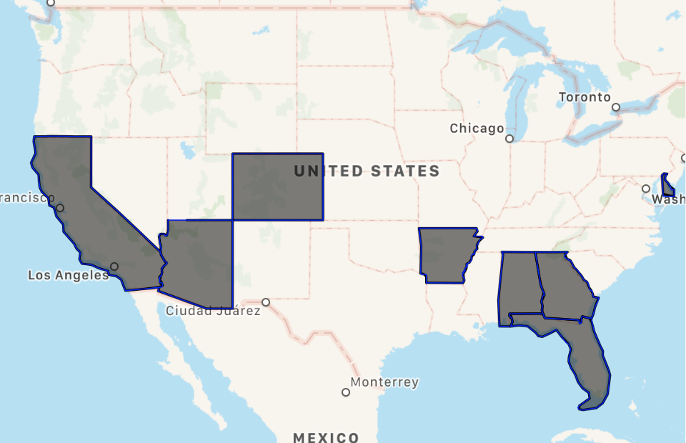

# Countries borders
A dataset of countries borders for iOS (pList format). The dataset currently contains 11 US states and 13 European countries. Every country is identified by its country code (for example ITA for Italy, POR for Portugal).

## How to encode for MapKit
```
 public static func getStates() -> [State] {
        guard let path = Bundle.main.path(forResource: "States", ofType: "plist"), let array = NSArray(contentsOfFile: path) else { return [] }
        var states = [State]()
        for item in array {
            let dictionary = item as? [String : Any]
            let name = dictionary?["state"] as? String
            let borders = dictionary?["borders"] as! [NSArray]
            var points = [CLLocationCoordinate2D]()
            for coordinate in borders {
                let latitude = coordinate[0] as? Double ?? 0
                let longitude = coordinate[1] as? Double ?? 0
                let coordinate = CLLocationCoordinate2DMake(latitude, longitude)
                points.append(coordinate)
            }
            let state = State(name: name, borders: points)
            states.append(state)
        }
        return states as [State]
    }
 ```
 ## Use Case
 The dataset can be used to draw borders between countries using `MKPolyline` and `MKPolygon` from MapKit.
 
 
 
 ## TODOs
 - [ ] Add all European countries
 - [ ] Add all US countries
